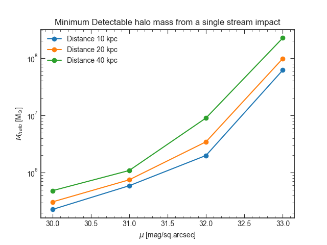

stream_gap_lsst
===============

Repository for investigations about how sensitive LSST and related
experiments could be to stellar-stream density perturbations.

Contributors
-------------

* Sergey Koposov - [@segasai](https://github.com/segasai)
* Ting Li - [@sazabi4](https://github.com/sazabi4)
* Jo Bovy - [@jobovy](https://github.com/jobovy)

Dependencies
------------

This code has the following dependencies:

* [numpy](https://github.com/numpy/numpy)
* [astropy](https://github.com/astropy/astropy)
* [galpy](https://github.com/jobovy/galpy)
* [ugali](https://github.com/DarkEnergySurvey/ugali)
* [ebf](https://github.com/segasai/ebfpy)
* Some code from the [DESC](https://github.com/LSSTDESC) to run the photometric-error code

Key plot
--------

The key plot from this hack can be produced by
```
import mock_sim
mock_sim.make_plot('figure.png')
```


which at the time of writing produces the following figure:




